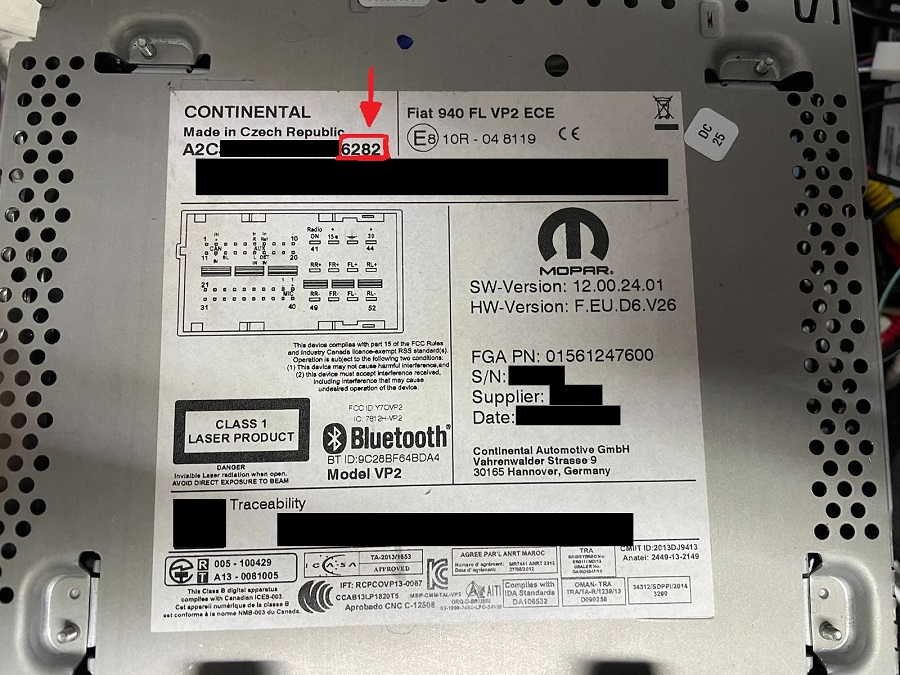

# VP1/VP2 Unlock Code Calculator

Calculates unlock (anti-theft) code for VP1/VP2 radios, needs last 4 digits of serial number (the one on top of oem sticker as pictured on photo below)

## Installation

Just needs python, I've chosen version 3.9

## Usage 

`
python .\anti-theft-code.py 0000
`

